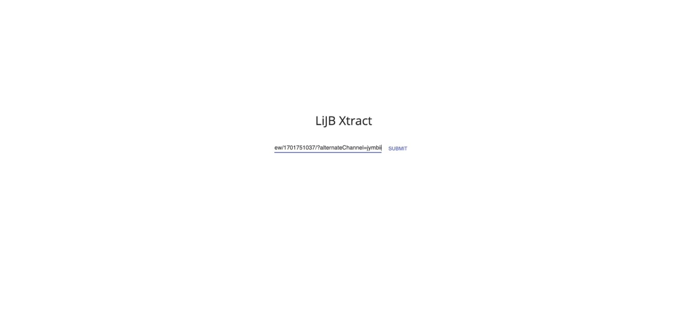
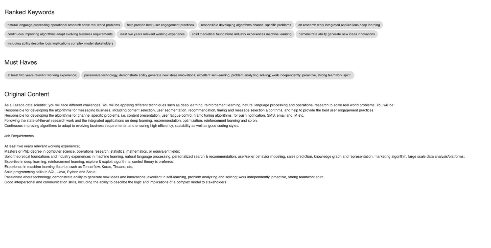

# LinkedInJobsScraper
 
## About
Wrote this simple Job Scraper for LinkedIn to identify keywords and "must-haves". Tried but unable to deploy on AWS as LinkedIn is blocking scrapping from AWS IP Addresses. However, this can be used locally by running the Flask App. Feel free to download and use it if you find it useful. Might improve it in the future to allow direct copy pasting from websites.

## Set up
Ensure you have Python 3 installed along with the libraries mentioned below

## Screenshots

## Libraries
1. Flask
2. NLTK
3. Rake - For keywords
